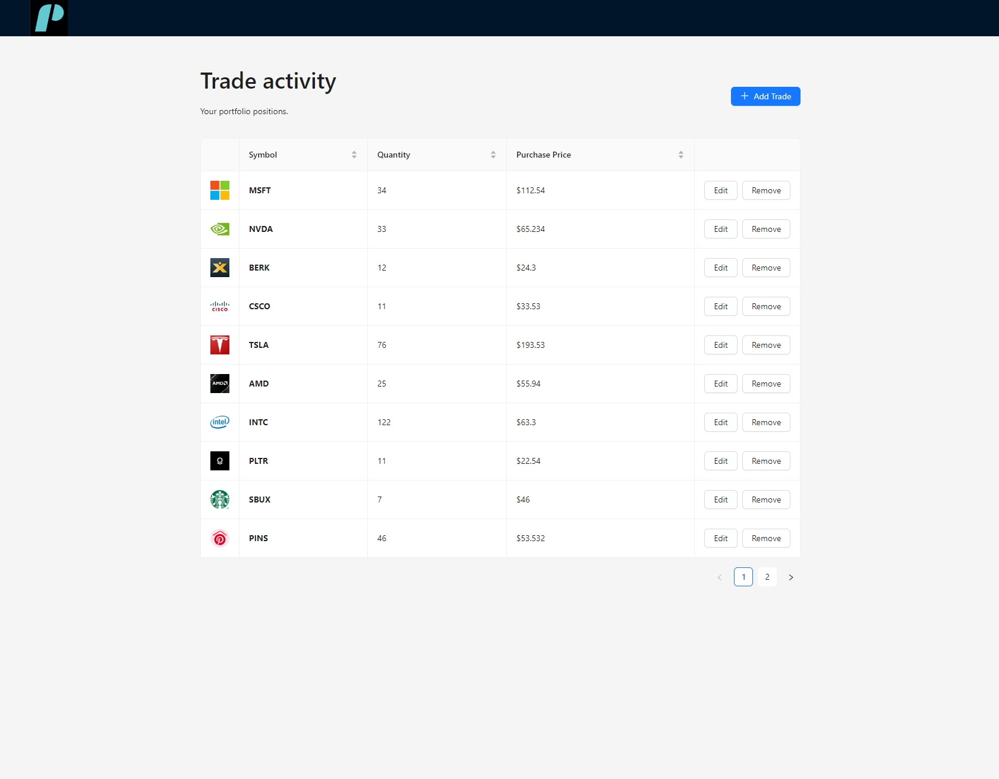
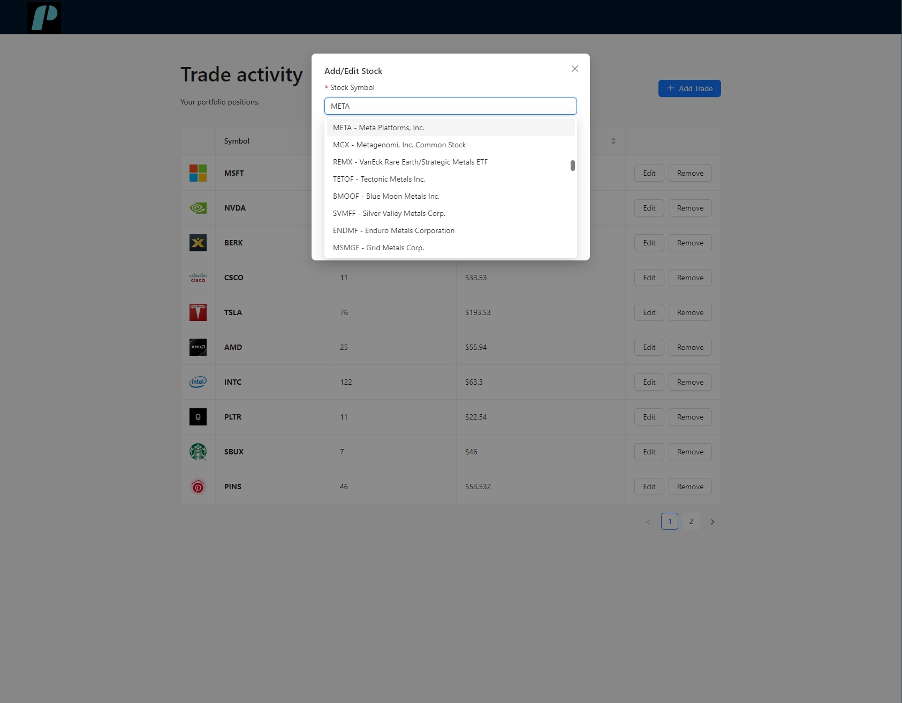
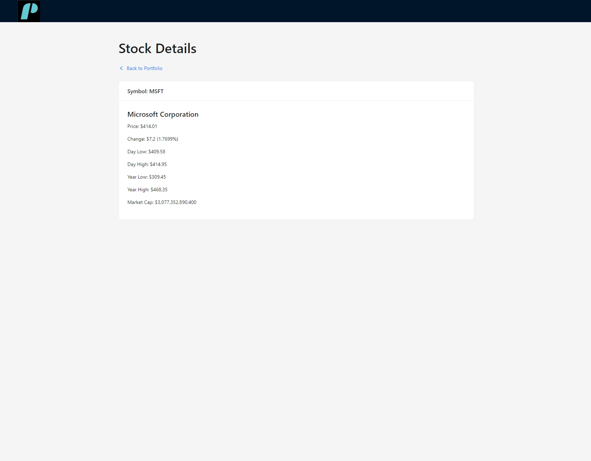

# Stock Management

## Description

Stock Management is a web application for managing stock portfolios. It allows users to view, add, edit, and remove stock positions, and provides functionality for searching and filtering stocks.

# Note:
- There is no authentication element in this assignment.
- I included the .env file with my (free) api key so it works straight out of the box.





## Features

- **View Portfolio**: See a list of stock positions in your portfolio.
- **Add Position**: Add a new stock position specifying the stock symbol, quantity, and purchase price.
- **Edit Position**: Modify the quantity and purchase price of an existing stock position.
- **Remove Position**: Remove a stock position from the portfolio.
- **Stock Details**: View details and the latest quote for individual stocks.
- **Search and Filter**: Search and filter stocks to easily find the ones you're interested in.

## Technologies Used

- **Frontend**: React, Ant Design, MobX
- **Backend**: NestJS, MongoDB
- **Workspace Management**: Nx

## Getting Started

### Prerequisites

- Node.js and npm installed.
- Nx CLI installed globally: `npm install -g nx`

### Installation

1. **Clone the repository**:

    ```bash
    git clone https://github.com/barakt12/Stock-management-assignment.git
    cd Stock-management-assignment
    ```

2. **Install dependencies**:

    Navigate to the root directory of the Nx workspace and run:

    ```bash
    npm install
    ```

### Running the Application

1. **Serve the API**:

    ```bash
    nx serve api
    ```

    The backend API will be available at `http://localhost:3000`.

2. **Serve the Frontend**:

    ```bash
    nx serve stock-management
    ```

    The frontend application will be available at `http://localhost:4200`.

### Running Tests

To run tests for the frontend and backend, use the following commands:

- **Frontend Tests**:

    ```bash
    nx test stock-management
    ```

- **Backend Tests**:

    ```bash
    nx test api
    ```

### Building the Application

To build the application for production, use the following commands:

- **Build the Frontend**:

    ```bash
    nx build stock-management
    ```

- **Build the Backend**:

    ```bash
    nx build api
    ```

### Configuration

- **Environment Variables**: Configure environment variables in `.env` files as needed for your development and production environments.

